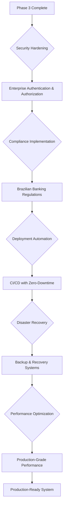

# Phase 4: Production-Ready Features - Banking System Development

## Overview

This phase transforms the modular monolith into a production-ready banking platform with enterprise-grade security, comprehensive compliance features, advanced deployment automation, and complete operational excellence. The system will be ready for real-world banking operations with all necessary security, monitoring, and compliance capabilities.

## Phase Objectives

- Implement enterprise-grade security and compliance features
- Add comprehensive regulatory compliance for Brazilian banking
- Implement advanced deployment automation and CI/CD
- Add disaster recovery and business continuity capabilities
- Implement comprehensive performance optimization
- Complete documentation and operational procedures


## Architecture Decision Flow




## System Architecture Overview

The production-ready banking system architecture incorporates multiple layers of security, compliance, and operational excellence:

### **Load Balancer \& CDN Layer**

- **Load Balancer**: Distributes traffic across multiple application instances
- **CDN**: Serves static assets with global edge caching


### **Security Layer**

- **WAF (Web Application Firewall)**: Protects against web-based attacks
- **Rate Limiting \& DDoS Protection**: Prevents abuse and ensures availability
- **SSL/TLS Termination**: Encrypts all communication


### **API Gateway \& Authentication**

- **GraphQL Gateway with Auth**: Unified API entry point with authentication
- **OAuth 2.0 Authorization Server**: Enterprise-grade authorization
- **Multi-Factor Authentication**: Enhanced security for sensitive operations


### **Modular Banking Application**

The core banking modules working together:

- **Authentication Module**: User management and security
- **Account Module**: Bank account operations
- **Transaction Module**: Payment processing
- **Notification Module**: Multi-channel communications
- **Compliance Module**: Regulatory requirements
- **Reporting Module**: Business intelligence and regulatory reports


### **Infrastructure Services**

- **RabbitMQ Cluster**: High-availability message processing
- **Redis Cluster**: Distributed caching and session management
- **PostgreSQL Primary/Replica**: Database with read scaling


### **Monitoring \& Observability**

- **Prometheus Cluster**: Metrics collection and alerting
- **Grafana Enterprise**: Advanced dashboards and visualization
- **ELK Stack**: Centralized logging and analysis
- **Jaeger Tracing**: Distributed request tracing


### **Security \& Compliance**

- **Vault**: Secret management and encryption
- **Audit Service**: Comprehensive audit trail
- **Compliance Engine**: Automated regulatory compliance
- **Fraud Detection**: Real-time fraud prevention


### **External Services**

- **Backup Storage**: Disaster recovery and data protection
- **Email/SMS Providers**: Notification delivery
- **Banking Networks**: Integration with financial institutions
- **Regulatory Systems**: Compliance reporting and submission


## Key Architectural Decisions

### Security: Enterprise-Grade Authentication \& Authorization

**Decision**: Implement comprehensive security framework with OAuth 2.0, MFA, and advanced threat protection

**Rationale**: Banking systems require maximum security compliance and protection against sophisticated attacks

**Trade-off**: Increased complexity but essential for financial services

### Compliance: Brazilian Banking Regulation Compliance

**Decision**: Full compliance with Central Bank of Brazil regulations, LGPD, and international banking standards

**Rationale**: Legal requirement for operating banking services in Brazil

**Trade-off**: Significant implementation effort but mandatory for production banking

### Deployment: Zero-Downtime CI/CD with Blue-Green Deployment

**Decision**: Implement advanced deployment strategies with automated rollbacks and canary releases

**Rationale**: Banking systems cannot tolerate downtime during deployments

**Trade-off**: Complex deployment infrastructure but essential for 24/7 operations

### Disaster Recovery: Multi-Region Backup and Recovery

**Decision**: Implement comprehensive disaster recovery with automated failover capabilities

**Rationale**: Financial systems require guaranteed data protection and business continuity

**Trade-off**: Increased infrastructure costs but necessary for regulatory compliance

## Production-Ready Database Models

### Security Audit Model

```sql
SecurityAudit {
  id: UUID (Primary Key)
  event_type: Enum (LOGIN_ATTEMPT, PERMISSION_CHANGE, DATA_ACCESS, SECURITY_VIOLATION)
  user_id: UUID (Foreign Key -> User.id, Nullable)
  ip_address: INET (Not Null)
  user_agent: Text
  geo_location: JSONB (country, city, coordinates)
  risk_score: Integer (0-100)
  security_flags: Text[] (array of security concerns)
  session_id: UUID
  device_fingerprint: String
  success: Boolean (Not Null)
  failure_reason: String (Nullable)
  metadata: JSONB
  created_at: Timestamp (Default: now)
}
```


### Compliance Report Model

```sql
ComplianceReport {
  id: UUID (Primary Key)
  report_type: Enum (DAILY, WEEKLY, MONTHLY, QUARTERLY, ANNUAL, REGULATORY)
  report_period_start: Date (Not Null)
  report_period_end: Date (Not Null)
  generated_by: UUID (Foreign Key -> User.id)
  report_data: JSONB (Not Null)
  file_path: String (path to generated report file)
  status: Enum (GENERATING, COMPLETED, FAILED, SUBMITTED)
  regulatory_submission_id: String (Nullable)
  submitted_at: Timestamp (Nullable)
  created_at: Timestamp (Default: now)
  updated_at: Timestamp (Default: now)
}
```


### Fraud Detection Model

```sql
FraudDetection {
  id: UUID (Primary Key)
  transaction_id: UUID (Foreign Key -> Transaction.id, Nullable)
  user_id: UUID (Foreign Key -> User.id, Nullable)
  detection_type: Enum (RULE_BASED, ML_MODEL, BEHAVIORAL, PATTERN)
  risk_score: Decimal(5,2) (0.00-100.00)
  fraud_indicators: JSONB (detected patterns and flags)
  detection_model_version: String
  status: Enum (FLAGGED, UNDER_REVIEW, CLEARED, CONFIRMED_FRAUD)
  reviewer_id: UUID (Foreign Key -> User.id, Nullable)
  review_notes: Text
  action_taken: Enum (NONE, ACCOUNT_LOCKED, TRANSACTION_BLOCKED, INVESTIGATION_OPENED)
  created_at: Timestamp (Default: now)
  updated_at: Timestamp (Default: now)
}
```


### System Health Model

```sql
SystemHealth {
  id: UUID (Primary Key)
  component_name: String (Not Null)
  component_type: Enum (DATABASE, CACHE, MESSAGE_QUEUE, EXTERNAL_SERVICE, APPLICATION)
  health_status: Enum (HEALTHY, DEGRADED, UNHEALTHY, CRITICAL)
  response_time_ms: Integer
  error_rate_percent: Decimal(5,2)
  resource_usage: JSONB (CPU, memory, disk, network)
  last_check: Timestamp (Not Null)
  consecutive_failures: Integer (Default: 0)
  metadata: JSONB
  created_at: Timestamp (Default: now)
}
```


## Step-by-Step Implementation Instructions

### Step 1: Enterprise Security Implementation

**Implement comprehensive authentication system**

- Add multi-factor authentication (MFA) with TOTP and SMS
- Implement OAuth 2.0 with PKCE for mobile clients
- Add biometric authentication support
- Create adaptive authentication based on risk scoring

**Add advanced authorization and access control**

- Implement Role-Based Access Control (RBAC) with fine-grained permissions
- Add Attribute-Based Access Control (ABAC) for complex scenarios
- Create dynamic permission evaluation engine
- Implement session management with concurrent session limits

**Deploy enterprise security infrastructure**

- Set up Web Application Firewall (WAF) with custom rules
- Implement DDoS protection and rate limiting
- Add SSL/TLS certificates with automatic renewal
- Create network security groups and firewall rules

**Implement threat detection and response**

- Add real-time fraud detection algorithms
- Implement behavioral analysis for anomaly detection
- Create automated response system for security threats
- Add security incident tracking and response workflows


### Step 2: Brazilian Banking Compliance Implementation

**Implement Central Bank of Brazil (BACEN) compliance**

- Add required financial transaction reporting
- Implement anti-money laundering (AML) checks
- Create customer due diligence (CDD) procedures
- Add sanctions screening and PEP (Politically Exposed Person) checks

**Add LGPD (Brazilian GDPR) compliance**

- Implement consent management for data processing
- Add data portability and right to be forgotten
- Create privacy impact assessment workflows
- Implement data anonymization and pseudonymization

**Create comprehensive audit trail**

- Implement immutable audit logging for all transactions
- Add digital signatures for critical operations
- Create tamper-evident logging with blockchain verification
- Implement audit report generation for regulators

**Add regulatory reporting automation**

- Create automated daily, weekly, and monthly reports
- Implement real-time transaction monitoring and reporting
- Add regulatory submission APIs and workflows
- Create compliance dashboard for risk officers


### Step 3: Advanced Deployment Automation

**Implement CI/CD pipeline with security**

- Create multi-stage pipeline with security scanning
- Add automated dependency vulnerability scanning
- Implement code quality gates and security reviews
- Create automated penetration testing integration

**Add zero-downtime deployment strategies**

- Implement blue-green deployment with automated testing
- Add canary deployments with automated rollback
- Create rolling deployments with health checks
- Implement database migration automation with rollback

**Create infrastructure as code**

- Implement complete infrastructure provisioning automation
- Add environment configuration management
- Create automated disaster recovery environment provisioning
- Implement infrastructure compliance and security scanning

**Add deployment monitoring and alerting**

- Create deployment success/failure monitoring
- Implement performance regression detection post-deployment
- Add automated rollback triggers based on metrics
- Create deployment notification and status dashboards


### Step 4: Disaster Recovery and Business Continuity

**Implement comprehensive backup strategy**

- Create automated database backups with point-in-time recovery
- Add file system and configuration backups
- Implement cross-region backup replication
- Create backup verification and restoration testing

**Add high availability and failover**

- Implement database clustering with automatic failover
- Add Redis clustering with sentinel for high availability
- Create RabbitMQ clustering with queue mirroring
- Implement application load balancing with health checks

**Create disaster recovery procedures**

- Implement automated disaster recovery site provisioning
- Add data synchronization between primary and DR sites
- Create automated failover and failback procedures
- Implement disaster recovery testing and validation

**Add business continuity planning**

- Create business impact analysis and recovery time objectives
- Implement communication procedures for outages
- Add customer notification systems for service disruptions
- Create emergency response procedures and contact lists


### Step 5: Performance Optimization and Scalability

**Implement advanced database optimization**

- Add database partitioning for large transaction tables
- Implement database connection pooling optimization
- Create automated database performance tuning
- Add database query optimization and index recommendations

**Add comprehensive caching strategies**

- Implement distributed caching with Redis Cluster
- Add application-level caching with intelligent invalidation
- Create edge caching with CDN integration
- Implement cache warming and preloading strategies

**Optimize application performance**

- Add GraphQL query optimization and batching
- Implement background job processing optimization
- Create connection pooling for all external services
- Add memory management and garbage collection tuning

**Implement scalability automation**

- Add horizontal pod autoscaling based on metrics
- Implement database read replica scaling
- Create message queue scaling automation
- Add predictive scaling based on usage patterns


### Step 6: Comprehensive Monitoring and Observability

**Implement production monitoring stack**

- Deploy Prometheus with high availability configuration
- Add Grafana Enterprise with advanced dashboards
- Implement ELK Stack with security and compliance features
- Add distributed tracing with Jaeger

**Create comprehensive alerting system**

- Implement intelligent alerting with machine learning
- Add escalation procedures and on-call management
- Create alert fatigue reduction with smart grouping
- Implement incident response automation

**Add business intelligence and reporting**

- Create real-time business metrics dashboards
- Implement customer usage analytics
- Add financial reporting and KPI tracking
- Create regulatory reporting automation

**Implement synthetic monitoring**

- Add synthetic transaction monitoring for critical user journeys
- Implement API endpoint monitoring from multiple locations
- Create performance benchmarking and SLA monitoring
- Add customer experience monitoring and alerting


### Step 7: Advanced Testing and Quality Assurance

**Implement comprehensive testing strategy**

- Add production-like load testing with realistic data volumes
- Implement chaos engineering with controlled failure injection
- Create security testing with automated penetration testing
- Add compliance testing with regulatory requirement validation

**Add production testing capabilities**

- Implement canary testing in production with real traffic
- Add A/B testing framework for feature validation
- Create shadow testing for new feature validation
- Implement blue-green testing with automatic rollback

**Create test data management**

- Implement synthetic test data generation for compliance
- Add test data privacy and anonymization
- Create test environment data refresh automation
- Implement test data lifecycle management

**Add continuous quality monitoring**

- Implement code quality tracking with SonarQube
- Add technical debt monitoring and reduction planning
- Create performance regression testing automation
- Implement security vulnerability continuous monitoring


### Step 8: Documentation and Operational Excellence

**Create comprehensive operational documentation**

- Document all operational procedures and runbooks
- Create incident response procedures and escalation
- Add disaster recovery procedures and testing schedules
- Create change management and deployment procedures

**Implement knowledge management system**

- Create searchable knowledge base for operations team
- Add troubleshooting guides with automated diagnostics
- Create training materials and certification programs
- Implement documentation as code with version control

**Add operational excellence automation**

- Implement automated health checks and remediation
- Add self-healing capabilities for common issues
- Create automated capacity planning and resource optimization
- Implement automated security patching and updates

**Create customer support integration**

- Add customer support ticketing system integration
- Implement customer communication templates
- Create customer impact assessment for incidents
- Add customer satisfaction tracking and improvement


## Expected Deliverables

### Security and Compliance Deliverables

- **Enterprise Security Framework**: Complete authentication, authorization, and threat protection
- **Brazilian Banking Compliance**: Full regulatory compliance with automated reporting
- **Security Operations Center (SOC)**: 24/7 security monitoring and incident response
- **Compliance Dashboard**: Real-time compliance status and regulatory reporting


### Operational Excellence Deliverables

- **Zero-Downtime Deployment**: Automated CI/CD with blue-green and canary deployments
- **Disaster Recovery System**: Complete backup, recovery, and business continuity capabilities
- **Performance Optimization**: Production-grade performance with sub-100ms response times
- **Comprehensive Monitoring**: Enterprise monitoring with predictive alerting and automation


### Production Readiness Deliverables

- **24/7 Operations Capability**: Complete operational procedures and automation
- **Customer Support Integration**: Full customer support and communication systems
- **Business Intelligence**: Real-time business metrics and regulatory reporting
- **Knowledge Management**: Complete documentation and training systems


## Success Criteria

### Security and Compliance Success

- ✅ Pass external security audit and penetration testing
- ✅ Achieve 100% compliance with Brazilian banking regulations
- ✅ Implement 24/7 security monitoring with <5 minute response times
- ✅ Zero security incidents in production for 90 days
- ✅ All regulatory reports generated and submitted automatically


### Operational Excellence Success

- ✅ Achieve 99.99% system uptime across all modules
- ✅ Zero-downtime deployments with automated rollback capability
- ✅ Mean Time to Recovery (MTTR) under 15 minutes for critical issues
- ✅ Disaster recovery tested and validated quarterly
- ✅ All incidents resolved within SLA requirements


### Performance and Scalability Success

- ✅ API response times consistently under 100ms for 95th percentile
- ✅ System handles 50,000+ concurrent users without degradation
- ✅ Database queries optimized with <50ms average execution time
- ✅ Cache hit ratio above 90% for frequently accessed data
- ✅ Automatic scaling responds to load within 2 minutes


### Business Readiness Success

- ✅ Complete operational procedures documented and tested
- ✅ Customer support integration provides real-time system status
- ✅ Business intelligence dashboards provide actionable insights
- ✅ All team members trained and certified on production procedures
- ✅ Change management process ensures controlled production changes


## Common Pitfalls to Avoid

- **Over-Engineering Security**: Balance security requirements with usability and performance
- **Compliance Shortcuts**: Never compromise on regulatory requirements for speed
- **Deployment Complexity**: Keep deployment automation simple and reliable
- **Monitoring Overload**: Focus on actionable alerts and meaningful metrics
- **Documentation Debt**: Maintain documentation currency with system changes


## Final Architecture Assessment

### Production Readiness Checklist

- ✅ **Security**: Enterprise-grade authentication, authorization, and threat protection
- ✅ **Compliance**: Full regulatory compliance with automated reporting
- ✅ **Performance**: Production-grade performance under realistic load
- ✅ **Reliability**: High availability with disaster recovery capabilities
- ✅ **Monitoring**: Comprehensive observability with predictive alerting
- ✅ **Operations**: 24/7 operational capability with automation
- ✅ **Documentation**: Complete operational and user documentation
- ✅ **Support**: Customer support integration and communication systems


## Knowledge Gained Through Complete Project

By completing all four phases, you will have mastered:

### Phase 1 Foundation:

- GraphQL API design and implementation
- PostgreSQL modeling for financial applications
- Docker-based development environments
- Banking domain fundamentals


### Phase 2 Enhanced Complexity:

- Event-driven architecture patterns
- Redis caching strategies and optimization
- External service integration
- Performance monitoring and optimization


### Phase 3 Modular Patterns:

- Domain-driven design and modular architecture
- Message queue patterns with RabbitMQ
- Advanced GraphQL with schema stitching
- Production monitoring with Prometheus and Grafana


### Phase 4 Production Ready:

- Enterprise security and compliance
- Zero-downtime deployment automation
- Disaster recovery and business continuity
- Operational excellence and monitoring


## Project Completion and Next Steps

This banking system now represents a **production-ready financial platform** that could handle real-world banking operations. The modular monolith architecture provides the foundation for potential future migration to microservices while maintaining operational simplicity.

### Potential Evolution Paths:

- **Microservices Migration**: Each module can be extracted into independent services
- **Multi-Tenant SaaS**: Extend to support multiple banking clients
- **International Expansion**: Add support for other countries' banking regulations
- **Advanced AI/ML**: Integrate advanced fraud detection and customer insights

The journey from a simple monolithic banking application to a production-ready, enterprise-grade financial platform demonstrates the evolution of modern software architecture and the importance of building systems that can grow with business requirements while maintaining security, compliance, and operational excellence.

